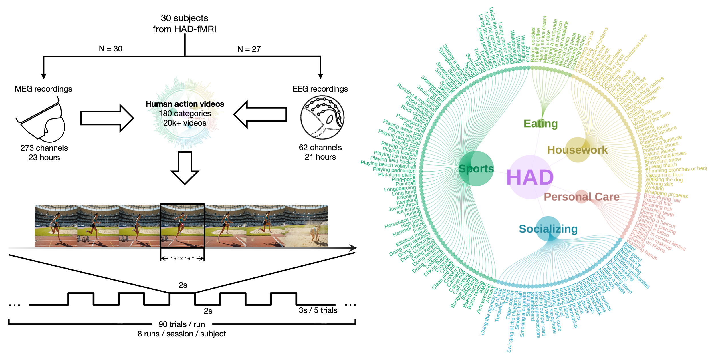

# HAD-MEEG: Human Action Dataset of Magnetoencephalography and Electroencephalography

This repository provides the codebase for preprocessing, validation, and visualization associated with the *[A large-scale MEG and EEG dataset for human action recognition](https://reqbin.com/)*.


## Installation
Code is tested with **Python 3.11+** on Linux and MacOS.

This analyse uses [`uv`]((https://docs.astral.sh/uv/getting-started/installation/)) for Python dependency management.

```bash
git clone https://github.com/colehank/HAD-MEEG.git
cd HAD-MEEG
uv sync
```

Or, you can still install the dependencies with pip.

```bash
git clone https://github.com/colehank/HAD-MEEG.git
cd HAD-MEEG

# using venv
python -m venv .venv
source .venv/bin/activate # On Windows: .venv\Scripts\activate

# or using conda
# conda create -n had-meeg python=3.11
# conda activate had-meeg

pip install -r requirements.txt
```

## Configuration

1. Download `HAD-MEEG` from OpenNeuro [dsxxxxxx]()

1. Rename `.env_example` to  `.env`.

2. Edit `.env` and set `MEEG_BIDS_ROOT` to the path of the `HAD-MEEG`'s root directory on your machine.  The `.env` file is loaded at runtime to locate the dataset.

After this, you should be able to run all analyses in `scripts/`.

## Usage

All analysis scripts are located in the `scripts/` directory. You can run them using `uv run scripts/step-*.py` or `python scripts/step-*.py` from project directory.
